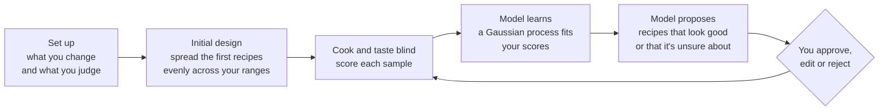

# Bayesian Chef

**Stop guessing at recipes. Run experiments on them, the way scientists design new materials.**

**Try it now:** https://smitra43.github.io/Bayesian-cooking/ (works on a phone, no install)

---

## The problem

Say you want the perfect lemonade. You can change how much lemon goes in,
how much sugar, which sweetener, a pinch of salt, some zest. Five knobs.

The usual approach is to change one thing at a time: fix everything, try
more sugar, then less, pick the best, move on to lemon. It feels sensible,
but it fails in two ways:

1. **Ingredients interact.** The best amount of sugar depends on how much
   lemon you used. Changing one thing at a time can walk right past the
   best combination and never see it.
2. **It's slow.** Five knobs with five settings each is 5 × 5 × 5 × 5 × 5 =
   3,125 possible lemonades. You'll taste maybe 30.

So the real question is: **which 30 lemonades should you make to learn the
most?**

Scientists face the same problem when they search for a new battery
material or drug molecule, where each experiment costs days and money. Their
answer is **Bayesian optimisation**: build a statistical model of
everything you've tried so far, including how *unsure* it is, and let it
pick the next experiments that are most worth running. Bayesian Chef does
that for your kitchen.

## What it does



1. **Set up.** You list the *factors* (things you change, like grams of
   sugar or pan temperature) with the range you're willing to try, and the
   *outputs* (things you judge, like "how much do I like it, 1 to 9").
2. **Initial design.** The first few sessions spread recipes evenly across
   all your ranges, so the model gets a fair look at everything.
3. **Taste blind.** Each sample gets a random 3-digit code and a random
   tasting order, so you can't favour the one you expect to win.
4. **Learn.** A model (a *Gaussian process*) fits a smooth surface through
   your scores and estimates how uncertain it is everywhere else.
5. **Propose.** The app suggests recipes that are either predicted to be
   great, or in areas the model knows little about. You approve, edit or
   reject each one before cooking.
6. **Repeat.** Every session makes the model sharper. Usually after 15 to 30
   tastings you'll have a recipe you couldn't have found by guessing.

There's a ready-made example (an omelette with 33 simulated tastings) so you
can explore the charts before cooking anything.

## Quick start

### Use it in your browser

Open **https://smitra43.github.io/Bayesian-cooking/**.

1. Pick **+ New experiment…** from the menu at the top and choose a
   template. Lemonade is the quickest to test for real.
2. Check the ranges in **Setup**.
3. Go to **Cook**, press **Plan session 1**, approve the recipes, make them,
   and follow the steps.

Your experiments are saved in that browser. Use **Log → Back up experiment**
to move them to another device.

### Run it on your own computer

You need [Git](https://git-scm.com/), and Python 3 to run a tiny local web
server.

```bash
git clone https://github.com/smitra43/Bayesian-cooking.git
cd Bayesian-cooking
app/tools/build-site.sh              # builds the site into _site/
python3 -m http.server -d _site 8000 # serves it locally
```

Then open http://localhost:8000. On Windows, run the build script in Git
Bash.

### The command-line version

There's also a Python version that runs in a terminal and stores
experiments as text files, which is handy for scripting.

```bash
pip install -e '.[dev]'
chef init lemonade.toml --template beverages/lemonade
chef next lemonade.toml      # propose a session; approve, edit or reject each recipe
chef record lemonade.toml    # enter your scores
chef status lemonade.toml    # best recipes so far and the model's best guess
```

Other templates: `blank`, `omelette`, `bread`, `vinaigrette`,
`beverages/chai`, `beverages/margarita`. The file format is described in the
[code tour](docs/code-tour.md#the-python-command-line-version).

## Learn more

| Guide | Read it if you want to… |
|---|---|
| [How it works](docs/how-it-works.md) | understand the ideas: experimental design, scoring, Gaussian processes, choosing the next recipe, blind tasting. No statistics background needed. |
| [Code tour](docs/code-tour.md) | find your way around the code, follow what happens when you press a button, or add a template, measurement or model. |
| [Debugging guide](docs/debugging.md) | fix something that isn't working, run the tests, or read an error message. |

## What's in this repository

```
app/                 the browser app (plain HTML, CSS and JavaScript, no build step)
  index.html         page layout and all the styling
  ui/app.js          screens, buttons, saving, charts
  engine/            the maths: designs, models, choosing recipes, analytics
  tests/             automated tests for the engine
  tools/             scripts to build the website and regenerate example data
bayesian_chef/       the Python command-line version
  templates/         starter experiments (TOML files)
tests/               automated tests for the Python version
docs/                the guides linked above
.github/workflows/   automatic testing (ci.yml) and website publishing (pages.yml)
```

## Checking it works

```bash
node --test app/tests/engine.test.cjs   # 24 tests for the app's maths (needs Node.js 18+)
pytest -q                               # 18 tests for the Python version
```

Both run automatically on every pull request, and every push to `main`
republishes the website.

## Where the ideas come from

The tasting advice follows standard sensory-science practice, and the
experimental designs come from the statistics literature. The full list is
in [How it works](docs/how-it-works.md#sources).
