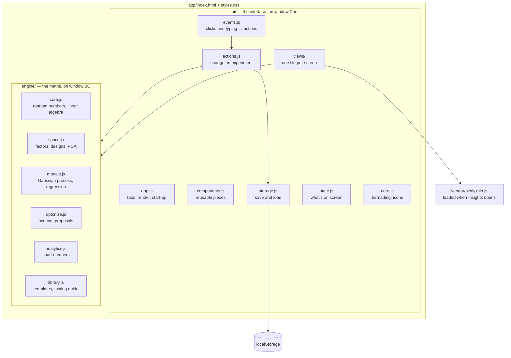
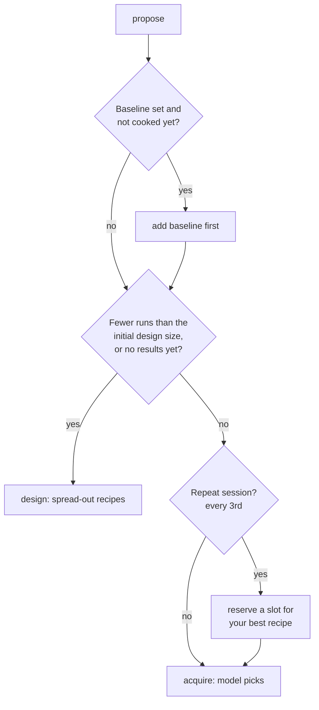

# Code tour

This guide walks through how the code is organised, what happens when you
press a button, where your data goes, and how to add things. It assumes you
can read basic JavaScript or Python. If a concept is unfamiliar, the
[How it works](how-it-works.md) guide explains the ideas.

**Contents**

1. [The big picture](#1-the-big-picture)
2. [The engine, file by file](#2-the-engine-file-by-file)
3. [The user interface](#3-the-user-interface)
4. [Following one click: "Plan session"](#4-following-one-click-plan-session)
5. [Where your data lives](#5-where-your-data-lives)
6. [Tests, CI and the website](#6-tests-ci-and-the-website)
7. [How to add things](#7-how-to-add-things)
8. [The Python command-line version](#the-python-command-line-version)

---

## 1. The big picture

The app is plain HTML, CSS and JavaScript. There's no framework (no React,
no Vue), no build step and no internet dependency: the browser runs the
files exactly as they are, straight from disk if you like. The only
third-party code is **Plotly** for charts, kept in `app/vendor/` together
with the fonts.



Two rules keep this understandable:

1. **The engine knows nothing about the screen.** Every engine function
   takes plain data (an experiment object) and returns plain data. That's
   why the engine can be tested in Node.js without a browser.
2. **The screen is always drawn from `state`.** Nothing on screen is the
   "real" data. Change the data, call `render()`, and the screen catches up.

### How the files connect

`index.html` lists the scripts at the bottom, in this order:

```
engine/core.js → space.js → models.js → optimize.js → analytics.js → library.js → example-data.js
ui/core.js → state.js → storage.js → components.js → actions.js
   → views/cook.js, insights.js, charts.js, log.js, setup.js, panels.js
   → events.js → app.js (last: it starts the app)
```

These are ordinary scripts, not ES modules, so the page also works when
opened as a file (browsers block modules on `file://`). To share code
between files, each file puts its functions on one shared object.

Every **engine** file looks like this:

```js
(function () {
  const BC = (globalThis.BC = globalThis.BC || {});
  function design(p, existing, k, rng, method) { ... }
  Object.assign(BC, { design, encode, ... });   // publish to other files
})();
```

Every **UI** file looks like this:

```js
(function () {
  "use strict";
  const Chef = (window.Chef = window.Chef || {});
  const { esc, nice, state } = Chef;   // helpers from earlier files
  function logView(p) { ... Chef.settings(p) ... }
  Object.assign(Chef, { logView, runSheet });
})();
```

- `(function () { ... })();` wraps the file so its private variables don't
  leak into other files.
- `BC` holds the maths; `Chef` holds the interface. Type either into the
  browser console to see everything in it.
- Helpers from files loaded **earlier** are unpacked at the top
  (`const { esc } = Chef`). Functions from files loaded **later** are
  called as `Chef.render()` at the moment they're needed, by which time
  every file has loaded. That's why load order matters, and why
  `app/tests/site.test.cjs` checks it.

## 2. The engine, file by file

### `engine/core.js`: basic tools

| Function | What it does |
|---|---|
| `Rng(seed)` | a random number generator you can **seed**. The same seed always gives the same sequence, so results can be reproduced. It provides `uniform()`, `normal()` (bell-curve numbers), `int(n)`, `choice(list)` and `permutation(n)`. |
| `cholesky`, `choleskyJitter`, `cholSolve`, `cholInverse` | matrix tools the Gaussian process needs. A Cholesky factor is a matrix "square root", the standard stable way to solve the GP's equations. `choleskyJitter` adds a tiny number to the diagonal if the matrix is numerically fragile. |
| `symEig` | eigenvalues and eigenvectors, used by PCA |
| `nelderMead(f, x0)` | minimises a function without needing its slope, used to fit GP settings |
| `mean`, `sd`, `normCdf`, `pearson` | basic statistics |

### `engine/space.js`: recipes as numbers

| Function | What it does |
|---|---|
| `checkProject(p)`, `checkRun(p, x)` | return a list of plain-English problems (empty list = valid). The Setup screen and planner show these. |
| `sample(p, n, rng, method)` | `n` random recipes (Latin hypercube, Halton or random) that respect every range and blend total |
| `sampleMixture` | a random blend that adds up exactly to its total |
| `encode(p, runs)` | turns recipes into rows of numbers between 0 and 1 (choices become one-hot switches) |
| `design(p, existing, k, rng, method)` | the initial design. `maxpro` and `maximin` call `optimizeLHS`, which swaps values in a Latin hypercube to spread it better. |
| `perturb(p, x, rng, radius)` | a nearby variation of a recipe, used for local search |
| `designQuality(p, runs)` | closest-pair distance, worst coverage gap, strongest correlation between factors |
| `fitPCA(X, options)` | principal component analysis with truncation by variance kept or by number of components |

### `engine/models.js`: the surrogate models

Both models return an object with the same methods, so the rest of the
code doesn't care which one you picked:

| Method | Returns |
|---|---|
| `predict(Xs, full)` | the predicted mean and variance at new recipes. With `full = true` it also returns the full covariance, which Thompson sampling needs. |
| `toY(z)` | converts from the model's internal rescaled units back to your units (e.g. liking 1–9) |
| `loo()` | leave-one-out predictions, for the Model check chart |
| `condition(x, z)` | a copy of the model with one extra pretend data point, used by the kriging-believer strategy |
| `info` | fitted hyperparameters and diagnostics |

- `fitGP(X, y, cols, opts)` builds a Gaussian process. It rescales the
  outputs, sets up the hyperparameters (lengthscales, signal, noise), and
  if there are at least `minPointsToFit` results, searches for the best ones
  with Nelder–Mead from several starting points. `KERNELS` holds the five
  kernel formulas.
- `fitBLR` builds Bayesian polynomial regression, learning its two
  precision settings with MacKay's evidence updates.
- `fitModel` picks one based on the settings.

### `engine/optimize.js`: scoring and proposing

| Function | What it does |
|---|---|
| `DEFAULT_SETTINGS`, `mergeSettings(s)` | every setting and its default. `mergeSettings` fills any missing setting with the default, so old saved projects keep working when new settings are added. |
| `desirability`, `combine`, `runScore` | the scoring described in How it works, section 4 |
| `fitAll(p, s)` | fits one model per output from all tasted runs |
| `candidatePool(p, s, rng)` | about 600 candidate recipes: mostly spread out, some near your best |
| `noGoFactors` | lowers candidates that are close to recipes you rejected |
| `propose(p, s, k, sessionNo)` | **the main entry point.** Returns `k` proposals for the next session. |
| `acquire(p, s, k, rng)` | the model-driven part of `propose`: Thompson sampling, or EI/UCB/PI with a batch strategy |

`propose` decides which phase you're in:



### `engine/analytics.js`: the numbers behind the charts

`progress`, `mainEffects`, `surface`, `diagnostics`, `runPCA`,
`correlations`, `pareto` and `replicates` each compute one chart's data.
`adviseSettings` produces the warnings in Advanced settings, such as
"ARD needs more results".

### `engine/library.js` and `engine/example-data.js`: content

- `TEMPLATES`: the starter experiments, each with a `folder` (Food or
  Beverages), factors, blends, baseline, outputs, settings and tasting
  `tips`.
- `OUTPUT_LIBRARY`: suggested measurements with instructions.
- `PROTOCOL` and `REFERENCES`: the tasting guide and its sources.
- `exampleProject()`: the omelette example. Simulating it is slow, so it's
  generated once by `app/tools/build-example.cjs` and saved in
  `example-data.js`.

## 3. The user interface

The interface lives in `app/ui/`. One pattern runs through all of it:

1. **All state lives in one object**, `Chef.state` (`ui/state.js`): which
   tab is open, the experiments, the proposals being reviewed, draft
   scores, and so on.
2. **`render()` rebuilds the screen from `state`** (`ui/app.js`). Each tab
   has a *view function* that returns an HTML string: `cookView`,
   `insightsView`, `logView`, `setupView`, one per file in `ui/views/`.
   `render()` puts that string into `<main>`.
3. **Clicks are handled in one place** (`ui/events.js`). Buttons carry a
   `data-act` attribute, like `<button data-act="plan">`. A single click
   listener reads `data-act` and runs the matching entry in the `ACTIONS`
   table. This is called *event delegation*.
4. **An action changes `state` or the experiment, calls `Chef.save()` if
   data changed, then calls `Chef.render()`.** The actions that change an
   experiment live in `ui/actions.js`.

So to find what a button does: search `ui/events.js` for its `data-act`
value.

| File | What's in it |
|---|---|
| `core.js` | formatting (`fmtNum`, `nice`), HTML escaping (`esc`), icons, `toast` messages |
| `state.js` | the `state` object, `cur()` (the open experiment), `settings(p)` |
| `storage.js` | `save`, `connect` (load at start-up), `removeProject` |
| `components.js` | recipe summaries, value lists, form fields, the rating question, dialogs, `offerFile` (downloads) |
| `actions.js` | `planSession`, `startSession`, `saveResult`, `createProject`, `importFile`, renaming helpers |
| `views/cook.js` | the Cook tab: plan card, review, Prep → Taste → Done |
| `views/insights.js` | the Insights tab's HTML and `analyticsFor` (all the numbers, cached) |
| `views/charts.js` | Plotly loading (`ensurePlotly`) and every chart (`drawInsights`) |
| `views/log.js` | the Log table and the edit-a-run panel |
| `views/setup.js` | the Setup tab and the New experiment dialog |
| `views/panels.js` | slide-over panels: Advanced settings (with presets), Guide, a single run |
| `events.js` | every click, typing and change handler |
| `app.js` | tabs, `render()`, the header, start-up |

Other attributes follow the same idea as `data-act`:

| Attribute | Used for |
|---|---|
| `data-tab` | switching tabs |
| `data-bind` | draft values: scores being typed, proposal edits |
| `data-f`, `data-o` | editing a factor or output in Setup (`"index:field"`) |
| `data-k` | an Advanced setting, as a path like `gp.kernel` |
| `data-ins` | Insights chart controls |

**Charts** are drawn after each render by `drawInsights`, which only
computes the chart for the view you've selected. Plotly is 3.5 MB, so
`ensurePlotly` loads `vendor/plotly.min.js` the first time you open
Insights instead of on every page load. Chart colours come from the CSS
variables in `styles.css` (read with `tok("--honey")` and similar), so they
follow light and dark mode.

**Security:** every piece of user text goes through `esc()` before it's put
into HTML. That stops a recipe named `<script>` from running as code.

## 4. Following one click: "Plan session"

Here's the whole journey when you press **Plan session 12**:

1. The button is `<button data-act="plan">`. The click listener in
   `ui/events.js` finds `ACTIONS.plan` and calls `Chef.planSession()`.
2. `planSession` (`ui/actions.js`) sets `state.planning = true` and renders,
   so you see "Choosing recipes…". It then waits 30 milliseconds
   (`setTimeout`) so the browser can actually paint that message before the
   heavy maths starts.
3. It calls `BC.propose(project, settings, batchSize, 12)`.
4. `propose` (in `engine/optimize.js`) sees the model phase, so it calls
   `acquire`, which:
   - fits a Gaussian process per output (`fitAll` → `fitGP`),
   - builds 600 candidates (`candidatePool`),
   - draws a plausible curve for each output and picks the best candidate
     (Thompson sampling), 3 times.
5. The proposals come back as a list of `{ x: recipe, phase, why,
   predictions }`. `planSession` stores them in `state.proposals`, each
   marked "approve".
6. `Chef.render()` runs again. Because `state.proposals` exists, `cookView`
   (`ui/views/cook.js`) shows `reviewView` instead of the plan card.
7. When you press **Start session**, `startSession()` turns each approved
   proposal into a **run** with `status: "planned"`, a unique 3-digit
   code, and a random tasting position (`taste`). Rejected ones become runs
   with `status: "rejected"` and your reason in `notes`.
8. `Chef.save(project)` stores it (next section) and the Cook tab switches
   to the Prep step.

## 5. Where your data lives

### The project object

Everything about one experiment is a single JSON object:

```json
{
  "id": "k3j9x2ab…",
  "name": "My lemonade",
  "template": "lemonade",
  "factors": [
    { "name": "lemon_juice", "type": "component", "group": "drink", "low": 8, "high": 22, "unit": "% by weight" },
    { "name": "sweetener_type", "type": "categorical", "levels": ["cane_sugar", "honey", "agave"] }
  ],
  "mixtures": { "drink": 100 },
  "batchAmounts": { "drink": { "amount": 250, "unit": "g" } },
  "baseline": { "water": 76, "lemon_juice": 12, "…": "…" },
  "outputs": [
    { "name": "liking", "goal": "maximize", "low": 1, "high": 9, "weight": 2, "unit": "1-9", "how": "…" }
  ],
  "settings": { "batchSize": 4, "acquisition": "thompson", "gp": { "kernel": "matern52" }, "…": "…" },
  "tips": ["Chill every sample…"],
  "sessions": 3,
  "runs": [
    {
      "id": "R001", "session": 1, "status": "done", "phase": "baseline",
      "code": "349", "taste": 2,
      "x": { "water": 76, "lemon_juice": 12, "…": "…" },
      "y": { "liking": 7, "sweet_jar": 3 },
      "notes": "", "why": "Your current recipe, cooked first as the reference."
    }
  ],
  "createdAt": "…", "updatedAt": "…"
}
```

- `x` holds the recipe (factor values). `y` holds your scores (outputs).
- `status` is `planned` (to taste), `done` (tasted) or `rejected`.
- `phase` says why the run exists: `baseline`, `doe` (initial design), `bo`
  (model pick), `replicate`, `manual` (you edited it) or `not-made`.

**Log → Back up experiment** saves exactly this object as a `.json` file,
and **Import backup** loads one.

### Saving

`save(project)` (`ui/storage.js`) updates `updatedAt`, then writes every
experiment to the browser's `localStorage` under the key `bc:projects`.
That storage belongs to this browser on this device (and, for a page opened
as a file, to local files in general), so clearing site data deletes it.
Keep backups.

Two small extra keys: `bc:current` remembers the last experiment you
opened, and `bc:tab` the last tab.

The example project is never saved until you change it.

**Optional claude.ai sync.** `connect()` also checks for `window.claude`,
which only exists when the page is hosted inside claude.ai as an artifact.
There it saves each experiment to that artifact's database
(`projects/<id>`) and syncs across devices. Everywhere else that object
doesn't exist, the check fails, and nothing else in the app depends on it.

## 6. Tests, CI and the website

Run all the app tests with `node --test app/tests/*.test.cjs`.

### Engine tests: `app/tests/engine.test.cjs`

These load the engine files into Node and check, among other things:

- the matrix maths solves equations correctly,
- every sample and design respects ranges and blend totals,
- optimised designs beat random ones,
- every kernel fits a known smooth function,
- ARD gives the relevant factor the shorter lengthscale,
- every acquisition method returns valid, distinct recipes,
- rejected recipes push proposals away,
- the model beats the initial design at finding a hidden best recipe,
- every template (including all Beverages) is valid.

### Page tests: `app/tests/site.test.cjs`

These catch mistakes that break the page without breaking the maths:

- `index.html` is a complete page (doctype, character set, viewport),
- every file it loads exists, including Plotly and each font,
- nothing is loaded from the internet,
- every script parses,
- the engine loads before the UI and `ui/app.js` is last,
- every `Chef.something` a UI file uses is actually defined by some UI file.

### Python tests: `tests/test_chef.py`

Run with `pytest -q`. They cover the command-line version, including a full
simulated plan, record and status loop.

### CI: `.github/workflows/ci.yml`

On every pull request, GitHub runs both test suites on a fresh machine
(**Python CLI tests** and **App tests**). A red ✗ on the pull request means
a test failed; click **Details** to see which one.

### The website: `.github/workflows/pages.yml`

On every push to `main`:

1. run the app tests,
2. run `app/tools/build-site.sh`, which copies what a browser needs
   (`index.html`, `styles.css`, `engine/`, `ui/`, `vendor/`) into `_site/`,
   leaving out `tests/` and `tools/`,
3. publish `_site/` to GitHub Pages.

## 7. How to add things

### A new template

1. Open `app/engine/library.js` and add an entry to `TEMPLATES`. Copy an
   existing one (lemonade is a good model) and change it. Give it a
   `folder` so it appears in the right group.
2. Run the engine tests. The "every template is valid" test checks your
   ranges, blends, baseline and outputs automatically.
3. For the command-line version, add a TOML file in
   `bayesian_chef/templates/` and its name to `TEMPLATES` in
   `bayesian_chef/cli.py`.

### A new screen or button

1. Write a view function that returns HTML in a new file under
   `app/ui/views/`, using the same wrapper as the other files, and publish
   it with `Object.assign(Chef, { myView })`.
2. Add a `<script>` line for it in `index.html`, before `ui/events.js`.
3. For a button, give it `data-act="my-action"` and add
   `"my-action": () => { ... }` to the `ACTIONS` table in `ui/events.js`.
4. Run `node --test app/tests/*.test.cjs`: the page tests will tell you if a
   file is missing or a `Chef.` name is undefined.

### A new suggested measurement

Add an entry to `OUTPUT_LIBRARY` in `app/engine/library.js` with a
`category`, `goal`, `low`, `high`, `unit` and a clear `how`. It appears in
Setup and in the Guide automatically. (For the command line, add it to
`OUTPUT_LIBRARY` in `bayesian_chef/guidance.py`.)

### A new kernel

1. Add a function to `KERNELS` in `app/engine/models.js`. It receives the
   squared scaled distance `r2` (and `alpha`, for kernels that need an extra
   setting) and must return 1 when `r2` is 0, falling towards 0 as `r2`
   grows.
2. Add it to the kernel `<select>` in `settingsSheet` in `app/ui/views/panels.js`.
3. Add its name to the kernel list in `engine.test.cjs`, so it's tested
   against a known smooth function.

### A new acquisition method

Add a `case` to the `switch (s.acquisition)` block in `acquire`
(`app/engine/optimize.js`). You get Monte Carlo samples of each candidate's
overall score in `samples`; return one number where higher means "cook this
next". Then add it to the acquisition `<select>` in `settingsSheet`
(`app/ui/views/panels.js`) and to
the acquisition test loop.

### After changing the engine

The example omelette data was produced by the engine. If you change how
proposals are chosen, regenerate it with `node app/tools/build-example.cjs`
and rerun the tests.

---

## The Python command-line version

`bayesian_chef/` is a terminal version of the same idea. It's smaller than
the app: greedy maximin initial designs, one Gaussian process per output
(RBF-style kernel with separate lengthscales for numbers and choices), and
batch Thompson sampling.

| File | What it does |
|---|---|
| `project.py` | reads and checks the TOML project file; factors, outputs, blends, sampling, encoding |
| `model.py` | the Gaussian process, with hyperparameters fitted by maximum a posteriori (scipy) |
| `optimize.py` | desirability scoring, space-filling design, Thompson sampling proposals |
| `store.py` | the run log: a CSV file saved next to the project (`lemonade.runs.csv`) |
| `guidance.py` | the tasting protocol and suggested measurements |
| `cli.py` | the `chef` commands |

### Commands

```bash
chef init lemonade.toml --template beverages/lemonade   # start from a template
chef next lemonade.toml          # propose a session; approve / edit / reject each run
chef record lemonade.toml        # enter results interactively
chef record lemonade.toml 503 liking=7   # or record by tasting code
chef status lemonade.toml        # best runs, noise estimates, model's best untested guess
chef outputs                     # list suggested measurements
chef add-output lemonade.toml salt_jar   # add one to the project
chef protocol                    # print the full tasting protocol
```

### The project file

```toml
name = "Omelette"
batch_size = 2       # runs per session
initial_runs = 8     # initial design size before the model takes over
tips = ["Use the same pan every time."]   # printed with each session

[[factors]]          # type: continuous | integer | categorical | component
name = "pan_temp_c"
type = "continuous"
kind = "process"
low = 120
high = 200

[[factors]]
name = "fat"
type = "categorical"
levels = ["butter", "ghee", "olive_oil"]

[baseline]           # optional: your current recipe, cooked first as the reference
pan_temp_c = 160
fat = "butter"

[[outputs]]          # goal: maximize | minimize | target
name = "texture_jar"
goal = "target"
target = 3
low = 1
high = 5
weight = 1
how = "Just-about-right: 1 much too runny, 3 just right, 5 much too firm."
```

- **Blends:** give each part `type = "component"` and the same `group`,
  and set the total under `[mixtures]`, for example `flour = 100`. See
  `bayesian_chef/templates/bread.toml`.
- **Log scale:** add `log = true` to a factor, for ratios where doubling
  matters more than adding.
- **Custom outputs:** `chef add-output lemonade.toml crunch --goal maximize --low 0 --high 10 --how "..."`,
  or edit the TOML directly.
